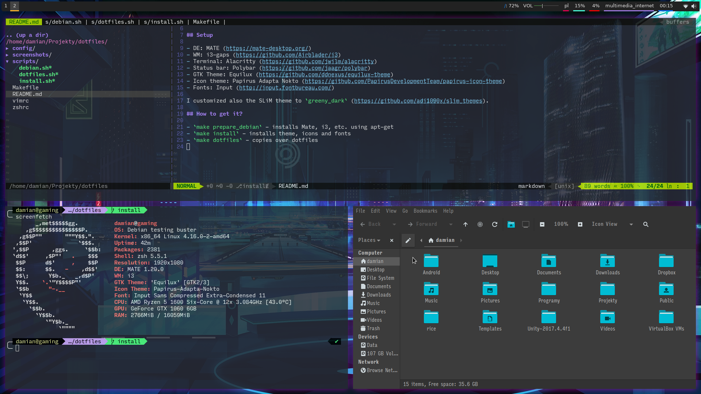

# Dotfiles

The repository contains install scripts and dotfiles for my desktop configuration.

## Setup

- DE: MATE (https://mate-desktop.org/)
- WM: i3-gaps (https://github.com/Airblader/i3)
- Terminal: Alacritty (https://github.com/jwilm/alacritty)
- Status bar: Polybar (https://github.com/jaagr/polybar)
- GTK Theme: Equilux (https://github.com/ddnexus/equilux-theme)
- Icon theme: Papirus Adapta Nokto (https://github.com/PapirusDevelopmentTeam/papirus-icon-theme)
- Fonts: Input (http://input.fontbureau.com/)

I customized also the SLiM theme to `greeny_dark` (https://github.com/adi1090x/slim_themes).

## How to get it?

- `make prepare_debian` - installs Mate, i3, etc. using apt-get
- `make install` - installs theme, icons and fonts
- `make dotfiles` - copies over dotfiles

